# Visual Novel Vertical Engine

[Русский](README.md) · [English](README-EN.md)

**Лёгкий офлайн-движок визуальных новелл для вертикальных экранов.**

<p align="center">
  <a href="https://ilyabarilo.github.io/vn-vertical-engine/"></a>
</p>

<p align="center">
  <a href="https://github.com/IlyaBarilo/vn-vertical-engine/releases/latest"></a>
  <a href="LICENSE"></a>
  <a href="https://github.com/IlyaBarilo/vn-vertical-engine/actions/workflows/release.yml"></a>
</p>

[Открыть демо](https://ilyabarilo.github.io/vn-vertical-engine/) ·
[Скачать полный архив](https://github.com/IlyaBarilo/vn-vertical-engine/releases/latest/download/vn-vertical-engine-latest.zip) ·
[Скачать обновление](https://github.com/IlyaBarilo/vn-vertical-engine/releases/latest/download/vn-vertical-engine-latest-update.zip) ·
[Первые шаги](FIRST-STEPS.md)

<p align="center">
  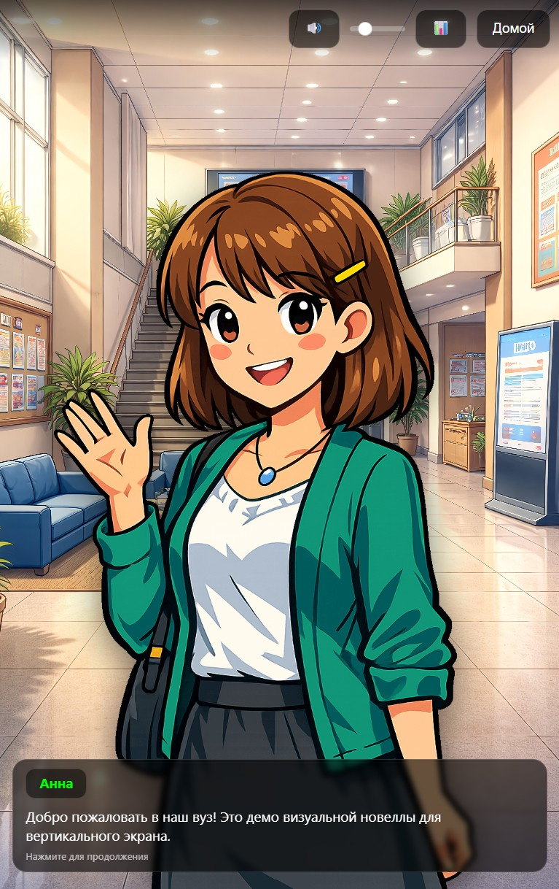
</p>

## Что это за проект

Visual Novel Vertical Engine — движок интерактивных историй на обычных
HTML, CSS и JavaScript. Он рассчитан прежде всего на портретные дисплеи 9:16:
планшеты, информационные стойки, сенсорные киоски, выставочные экраны и
инсталляции.

Проект можно открыть прямо из папки: сервер, сборщик и установка пакетов для
запуска не нужны. История хранится в читаемом текстовом сценарии, а 360°-сцены
и HTML-мини-игры подключаются при необходимости.

> **Статус:** проект активно развивается. Релизы предназначены для стабильного
> использования, а ветка `main` может содержать ещё не выпущенные изменения.

## Быстрый старт

1. Скачайте [полный архив последнего релиза](https://github.com/IlyaBarilo/vn-vertical-engine/releases/latest/download/vn-vertical-engine-latest.zip).
2. Распакуйте архив в отдельную папку.
3. Откройте `index.html` в поддерживаемом браузере.
4. Для своей истории скопируйте `story-example.js` в `story.js`.
5. Отредактируйте текст внутри `window.STORY_TEXT` и замените демонстрационные материалы своими.

Если `story.js` отсутствует, движок автоматически открывает демонстрационный
`story-example.js`.

### Какой архив выбрать

- `vn-vertical-engine-latest.zip` — полный комплект с демонстрационными медиа,
  360°-сценами, мини-играми и инструментами.
- `vn-vertical-engine-latest-update.zip` — обновление движка без папки `assets/`,
  пользовательского `story.js` и корневого `story-example.js`. Актуальный пример
  внутри такого архива находится в `docs/examples/story-example.js`.

Для первого запуска используйте полный архив. Вариант `-update` предназначен
для обновления уже созданной истории без замены её сценария и материалов.

Подробный маршрут от идеи до тестирования: [«Первые шаги»](FIRST-STEPS.md).

## Для кого

- для студентов и преподавателей, создающих учебные и просветительские истории;
- для авторов визуальных новелл и интерактивных рассказов;
- для разработчиков сенсорных киосков, музейных стендов и инсталляций;
- для команд, которым нужен автономный интерактивный проект без серверной части;
- для прототипов и демонстраций на портретных экранах.

Мини-игры, панорамы и специальные инструменты необязательны. Простую историю
можно собрать только из сценария, фонов, персонажей и звука.

## Основные возможности

- ветвящиеся сцены, выборы, переходы, условия и переменные;
- изображения, прокручиваемые фоны, видео, музыка и звуковые эффекты;
- персонажи с эмоциями, позиционированием, масштабом и фокусными точками;
- 360°-панорамы с точками перехода между локациями;
- автономные HTML-мини-игры с возвратом результата в сценарий;
- автоматическое сохранение и раздельные сохранения для нескольких историй;
- прямой запуск сцены для тестирования и режим без сохранений для киосков;
- статистика прохождения и граф связей между сценами;
- русский и английский интерфейс;
- управление мышью, клавиатурой и сенсорным экраном;
- адаптивный интерфейс, рассчитанный в том числе на 4K-дисплеи.

## Формат экрана: 9:16

Основной публичный формат проекта — **портретный экран 9:16**.

Внутри движка центральная адаптивная область ограничена соотношением до
**10:16**. Это технический запас: интерфейс корректно помещается как на
экранах и планшетах 9:16, так и на немного более широких устройствах 10:16.
В режиме `window = auto` фон, видео или 360°-сцена могут занимать весь
доступный экран, а диалог, меню и кнопки остаются в центральной области.

Для напольных стоек и экранов с особыми полями можно задать отступы через URL:

```text
index.html?topSpacing=500&bottomSpacing=800
```

## Совместимость

Проект проверялся в следующих окружениях:

| Платформа | Проверенные браузеры |
| --- | --- |
| Компьютер | Chrome, Edge, Firefox |
| Android | Chrome, Firefox |

Интерфейс также проверялся на реальном 4K-экране. Обозначение **4K-ready**
относится к работе и масштабированию интерфейса; итоговая чёткость фонов,
персонажей и видео зависит от разрешения материалов конкретной истории.

## Практическое использование

Движок используется на демонстрационных планшетах и на отдельном экране
университетского стенда. Это помогает проверять не только настольный запуск,
но и сенсорное управление, читаемость и поведение проекта на публичном экране.

<p align="center">
  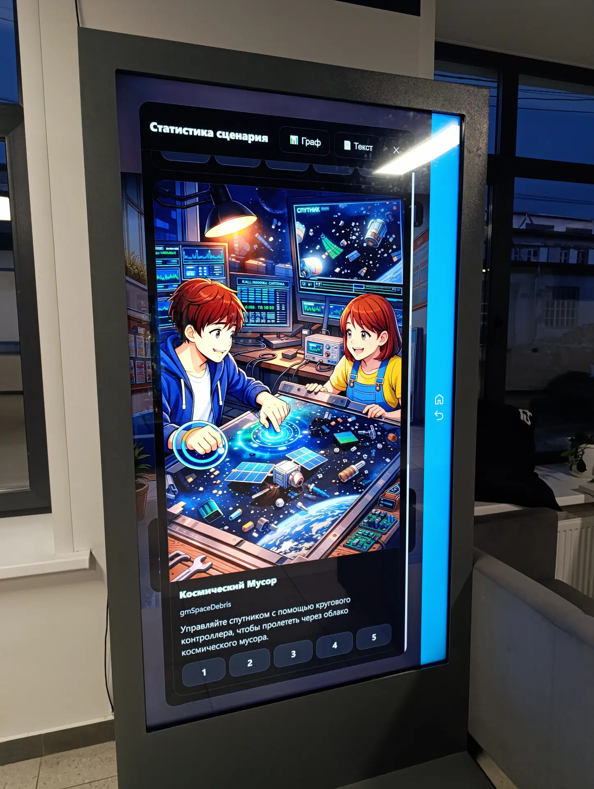
  
</p>

Для публичного устройства рекомендуется запуск без восстановления прогресса:

```text
index.html?nosave=true&mode=release
```

Можно также назначить отдельную историю через `novel` или открыть конкретную
сцену без сохранения:

```text
index.html?novel=exhibition&nosave=true
index.html?scene=scIntro01
```

Все режимы URL и правила автосохранения описаны в
[руководстве для начала работы](FIRST-STEPS.md#режимы-запуска-через-url).

## Интерфейс и режимы отображения

Основной интерфейс строится вокруг одной активной сцены: фона, персонажа,
реплики и вариантов выбора. Для широких экранов визуальный слой может занять
всю доступную область, сохраняя элементы управления в центральной портретной
зоне.

<details>
<summary><strong>Показать галерею интерфейса</strong></summary>

<p align="center">
  
  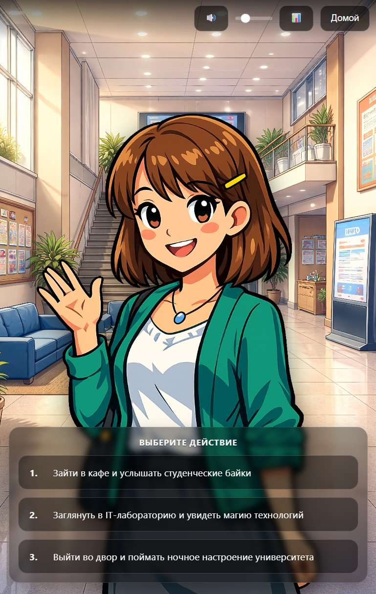
</p>

<p align="center">
  
  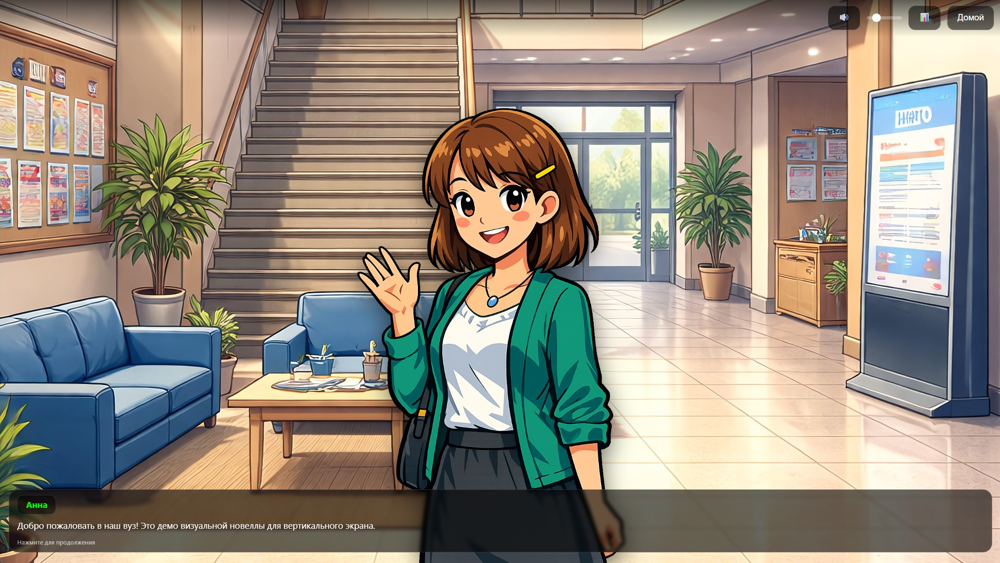
</p>

</details>

## Как устроен сценарий

Сценарий хранится в `story.js` как текстовый блок. Минимальный фрагмент выглядит
так:

```text
[meta]
title = "Моя история"
projectId = my-story
lang = ru
startScene = intro
engine.gameSandbox = strict

[scene]
scene intro
show anna welcome
anna: "Добро пожаловать!"

menu
"Продолжить" -> nextScene
"Остаться" -> intro

scene nextScene
"История продолжается."
```

Для новых историй оставляйте `engine.gameSandbox = strict`: так подключённые
HTML-игры выполняются в изолированном iframe. Старым доверенным играм при
необходимости можно задать `sandbox=legacy` в их строке секции `[game]`.

`projectId` отделяет автосохранение этой новеллы от других проектов на том же
домене. При копировании примера замените его на собственный постоянный id и не
меняйте после публикации. Старые новеллы без `projectId` продолжают использовать
прежний общий слот.

Формат специально остаётся простым: его можно редактировать в любом текстовом
редакторе, хранить в Git и обсуждать независимо от кода движка.

Полное описание секций, команд и проверок:
[спецификация сценария](docs/specs/spec-story.md).

## 360°-сцены

Панорамы позволяют осматривать пространство и переходить между связанными
точками. Для небольшого эпизода настройки можно хранить в основном сценарии;
для большой карты — вынести их в отдельный `story360.js`.

Пошаговая учебная инструкция от обычного вступления до связанных панорам,
фокусов и фотогалерей: [первая 360-новелла с нуля](docs/360-first-steps.md).

<p align="center">
  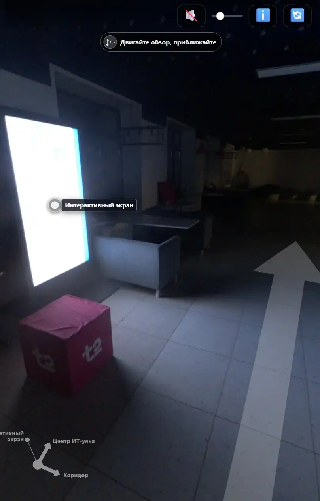
  
</p>

<details>
<summary><strong>Показать примеры панорамных локаций</strong></summary>

<p align="center">
  
  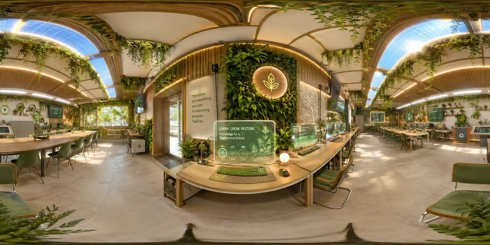
  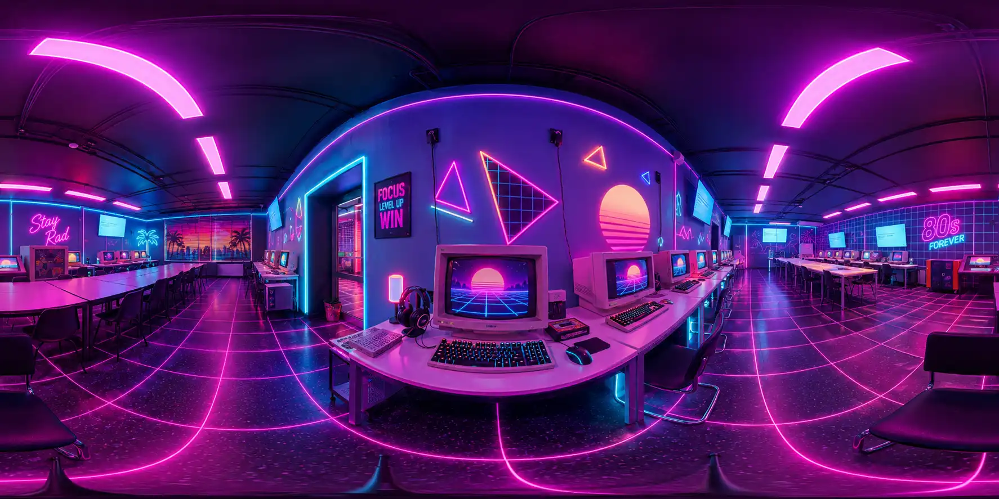
  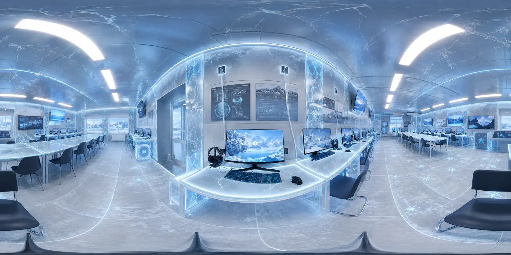
</p>

</details>

## HTML-мини-игры

Мини-игра — самостоятельный HTML-файл. Движок открывает её внутри истории,
передаёт сложность и данные, а затем получает результат в сценарную переменную.

<p align="center">
  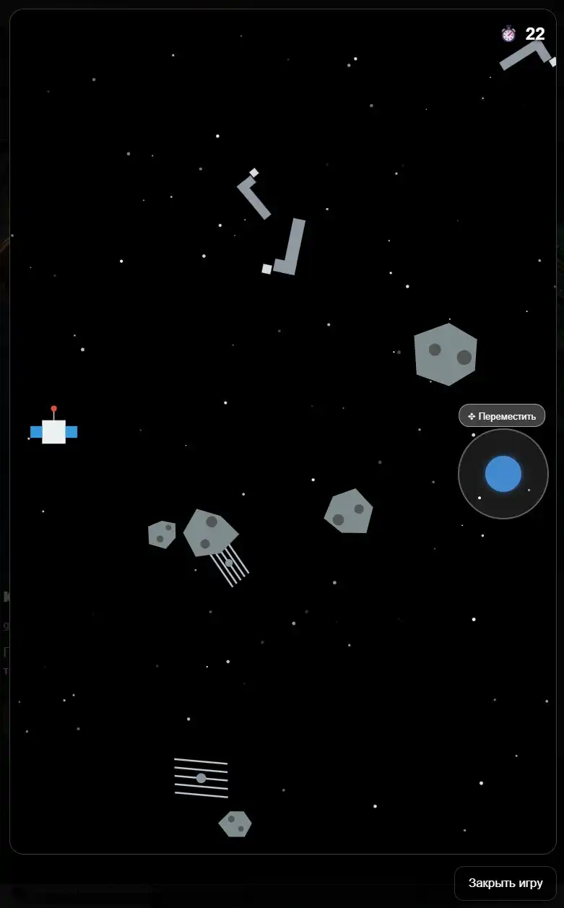
  
  
</p>

Проверить игру до подключения помогает `tools/game-tester.html`. Требования к
обмену сообщениями, параметрам и результатам собраны в
[спецификации мини-игр](docs/specs/spec-game.md). Тестер запускает игру в строгой
изоляции и проверяет `gameId`/`sessionId`; режим `Legacy` предназначен только для
доверенной старой игры и сопровождается подсказкой по переходу на протокол v2.

## Инструменты подготовки проекта

Инструменты находятся в `tools/` и открываются как обычные локальные
HTML-страницы:

| Инструмент | Назначение |
| --- | --- |
| `scene360-editor.html` | Собирает `story360.js`, связывает панорамы и расставляет точки перехода |
| `convert-360-img-to-css.html` | Упаковывает панорамные изображения в автономные CSS/JS-пакеты |
| `panorama-cleaner.html` | Заменяет выбранные области фрагментами второго снимка |
| `media-focus-editor.html` | Подбирает фокусные точки, масштаб и позиционирование медиа |
| `game-tester.html` | Отправляет игре тестовый `gameInit` и проверяет полученный `gameResult` |

`scene360-editor.html` импортирует `story360.js` как данные и загружает превью
панорамы только из `*-360.css`. Исходное изображение сначала преобразуйте в
конвертере. Прямая загрузка JPEG, PNG и WebP, а также элементы чтения и выполнения
legacy-пакетов `*-360.js` в редакторе отключены. Пути из импортированной карты не
выполняются автоматически. Внешние URL, абсолютные пути и `..` редактор не принимает.

### Очистка панорамы по второму снимку

Откройте `tools/panorama-cleaner.html` прямо из локальной папки. Для аккуратной
замены подготовьте две панорамы одинакового размера, снятые из одной точки:
основа A содержит итоговые метаданные, а снимок B — чистые области на месте
людей или движущихся объектов.

1. Загрузите основу A и источник B.
2. Обведите удаляемый объект рамкой и при необходимости подгоните смещение источника B.
3. Настройте растушёвку, проверьте результат в режиме предпросмотра и сохраните JPEG.

Результат сохраняется в исходном разрешении. Для основы в формате JPEG
инструмент переносит EXIF, XMP/GPano и ICC-профиль. Обработка выполняется
локально в браузере: выбранные панорамы никуда не отправляются.

Инструменты не требуются для запуска готовой истории и не заменяют текстовый
сценарий. Они помогают подготовить отдельные материалы и проверить интеграцию
до подключения к проекту.

<details>
<summary><strong>Показать интерфейсы инструментов</strong></summary>

<p align="center">
  
</p>

<p align="center">
  
</p>

<p align="center">
  
  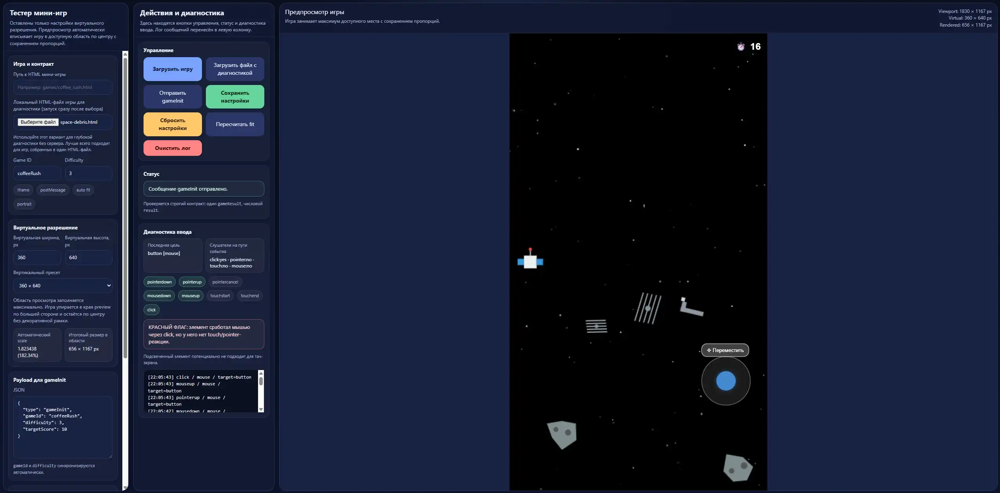
</p>

</details>

Наличие конкретного инструмента в готовом ZIP следует проверять по составу
выбранного релиза: ветка `main` может опережать стабильную сборку.

## Статистика и граф истории

В режиме разработки движок показывает посещённые сцены, значения переменных и
граф переходов. Граф строится локально с помощью включённой в проект библиотеки
Mermaid.

<p align="center">
  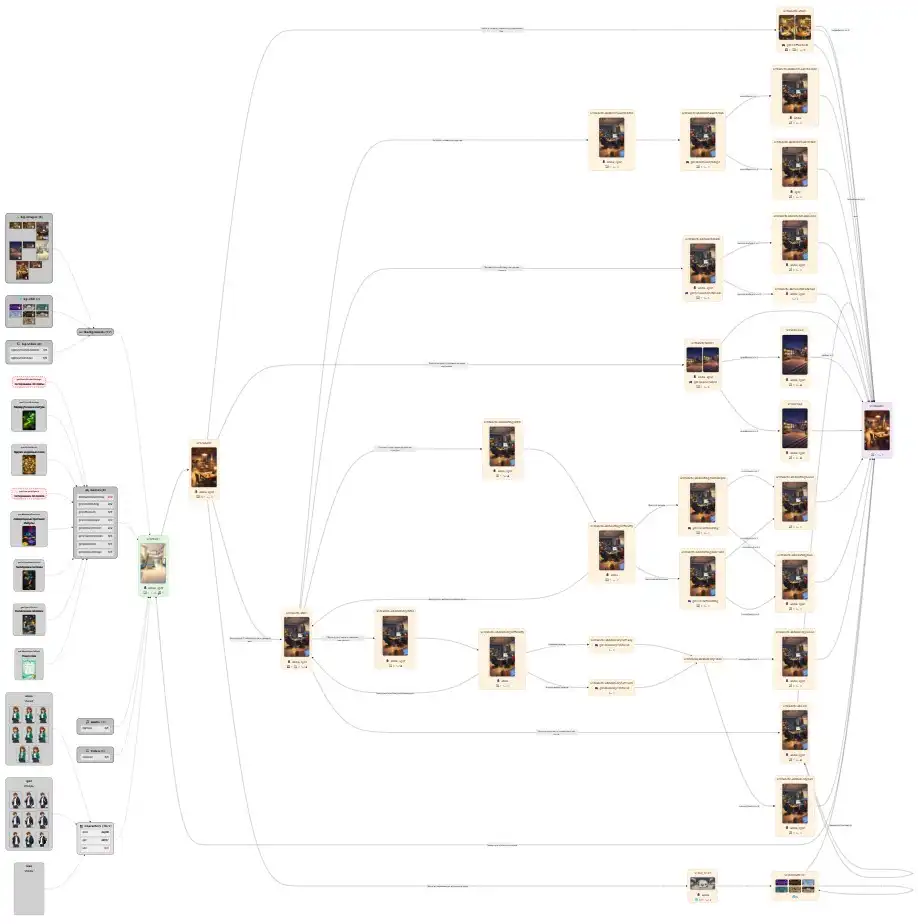
</p>

Проверка сценария помогает находить отсутствующие переходы и недостижимые
сцены. Отдельные представления показывают использование ресурсов и позволяют
запускать зарегистрированные мини-игры непосредственно из диагностического
раздела.

<details>
<summary><strong>Показать дополнительные средства анализа</strong></summary>

<p align="center">
  
  
</p>

<p align="center">
  
</p>

</details>

Для публичного показа включите `mode = release` в сценарии или добавьте к URL
`?mode=release`: кнопка статистики и обычные отладочные сообщения будут скрыты,
а предупреждения и ошибки останутся доступны в консоли.

## Офлайн-работа и зависимости

Для запуска истории не требуется устанавливать npm-пакеты, запускать сборку или
подключаться к серверу. Рабочие библиотеки Mermaid, three.js и jsrsasign уже
включены в репозиторий, поэтому во время выполнения сетевое подключение им не
нужно.

Это не означает полного отсутствия стороннего кода. Его перечень и отдельные
лицензии приведены в [NOTICE.md](NOTICE.md).

## Структура проекта

```text
project/
├── index.html                         точка запуска
├── story-example.js                   демонстрационный сценарий
├── story.js                           ваш сценарий, создаётся отдельно
├── story360.js                        необязательная карта 360°-пространства
│
├── engine/
│   ├── engine.css                     стили интерфейса
│   ├── engine.js                      основная логика движка
│   ├── game-protocol.js               сообщения движка и мини-игр
│   └── story-loader.js                загрузка и разбор сценария
│
├── assets/                            материалы истории
│   ├── backgrounds/                   фоны, широкие изображения и видео
│   ├── characters/                    персонажи и эмоции
│   ├── audio/                         музыка и звуковые эффекты
│   ├── games/                         HTML-мини-игры и их обложки
│   └── 360/                           автономные пакеты панорам
│
├── tools/                             локальные авторские инструменты
│   ├── scene360-editor.html           редактор маршрутов 360°
│   ├── convert-360-img-to-css.html    конвертер панорам
│   ├── panorama-cleaner.html          очистка панорам по второму снимку
│   ├── media-focus-editor.html        настройка фокуса медиа
│   └── game-tester.html               тестирование мини-игр
│
├── lib/                               сторонние библиотеки
│   ├── mermaid.min.js                 графы истории и ресурсов
│   ├── three.min.js                   отображение 360°-сцен
│   └── jsrsasign-all-min.js           проверка подписей лицензий
│
├── docs/
│   ├── specs/
│   │   ├── spec-story.md              спецификация сценария
│   │   └── spec-game.md               контракт HTML-мини-игр
│   ├── demo/images/                   снимки интерфейса
│   ├── 360/                           примеры панорам
│   ├── games/                         снимки мини-игр
│   ├── kiosk/                         фотографии реального стенда
│   ├── stat/                          проверка, статистика и графы
│   └── tools/                         снимки авторских инструментов
│
├── dev/                                разработка и проверка движка
│   ├── README.md                       инструкция по автотестам
│   ├── package.json                    npm-команды и зависимости тестов
│   ├── playwright.config.mjs           конфигурация браузерных тестов
│   └── tests/                          автономные и браузерные тесты
├── .github/
│   ├── DISCUSSION_TEMPLATE/            формы вопросов, идей и showcase
│   └── workflows/
│       ├── tests.yml                   проверки main и pull request
│       └── release.yml                 сборка ZIP и публикация Pages
├── FIRST-STEPS.md                     первые шаги на русском
├── FIRST-STEPS-EN.md                  первые шаги на английском
├── README.md                          основное описание на русском
├── README-EN.md                       сокращённое описание на английском
├── LICENSE                            PolyForm Noncommercial 1.0.0
├── COMMERCIAL-USE.md                  порядок коммерческого разрешения
└── NOTICE.md                          лицензии сторонних компонентов
```

`story.js` и `story360.js` показаны как рабочие файлы автора. Они могут
отсутствовать в чистой копии или не отслеживаться Git: демонстрация при этом
загружается из `story-example.js`.

### Куда смотреть для типовых задач

| Задача | Файл или каталог |
| --- | --- |
| Запустить демонстрацию | `index.html` |
| Начать собственную историю | `story-example.js` → `story.js` |
| Создать первую 360-новеллу | `docs/360-first-steps.md` |
| Изучить команды сценария | `docs/specs/spec-story.md` |
| Подключить мини-игру | `docs/specs/spec-game.md` и `tools/game-tester.html` |
| Собрать маршрут из панорам | `tools/scene360-editor.html` |
| Удалить людей или объекты с панорамы | `tools/panorama-cleaner.html` |
| Заменить материалы демонстрации | `assets/` |
| Обновить существующий проект | ZIP с суффиксом `-update` |

В релизном update-архиве отсутствуют `assets/`, `story.js` и корневой
`story-example.js`, поэтому обновление не заменяет материалы и сценарий
существующей новеллы. Актуальный пример остаётся в
`docs/examples/story-example.js`.

## Документация

- [Первые шаги на русском](FIRST-STEPS.md)
- [First Steps in English](FIRST-STEPS-EN.md)
- [Первая 360-новелла с нуля](docs/360-first-steps.md)
- [Спецификация сценария](docs/specs/spec-story.md)
- [Спецификация HTML-мини-игр](docs/specs/spec-game.md)
- [Автоматические тесты движка](dev/README.md)
- [Уведомления о сторонних библиотеках](NOTICE.md)
- [Коммерческое использование](COMMERCIAL-USE.md)

Спецификации можно использовать как точные технические контракты при ручной
разработке или передавать ИИ-помощнику вместе с задачей на сценарий либо
мини-игру. ИИ не требуется для работы движка и не является его основной
функцией.

## Ограничения

- движок ориентирован на портретные экраны, а не на универсальную игровую сцену;
- редактор сценария не встроен: основной файл редактируется как текст;
- качество и производительность медиа зависят от подготовки материалов;
- браузерные ограничения устройства по памяти, автозапуску звука и WebGL всё ещё действуют;
- ветка `main` не заменяет стабильный релиз для демонстрационного стенда.

## Обсуждения и обратная связь

[GitHub Discussions](https://github.com/IlyaBarilo/vn-vertical-engine/discussions)
— единая публичная площадка проекта. Выберите подходящий раздел:

- [Help](https://github.com/IlyaBarilo/vn-vertical-engine/discussions/categories/help) — вопросы, помощь со сценарием и сообщения о неожиданном поведении;
- [Ideas](https://github.com/IlyaBarilo/vn-vertical-engine/discussions/categories/ideas) — предложения по движку, документации и авторским инструментам;
- [Show Your Project](https://github.com/IlyaBarilo/vn-vertical-engine/discussions/categories/show-your-project) — публикация собственных новелл, инсталляций, мини-игр и экспериментов.

Формы подскажут, какие сведения приложить. Для возможной ошибки укажите версию
движка, устройство, браузер, способ запуска и минимальные шаги воспроизведения.
Не публикуйте ключи, пароли, `license-key.js` и закрытые пользовательские
материалы. Раздел Issues намеренно не используется.

## Автоматические тесты движка

После изменения парсера или логики проверок выполните `node --test`: основной
набор доступен Codex и локально без установки npm-пакетов. Браузерные
проверки реального интерфейса, `localStorage` и iframe запускаются отдельно
командой `npm --prefix dev run test:e2e` после установки зависимостей. GitHub
Actions выполняет оба набора. Автотесты проверяют код движка и не заменяют
статистику и графы конкретной новеллы. Подробнее: [dev/README.md](dev/README.md).

## Лицензия

Оригинальный код, авторские инструменты, технические примеры и сопроводительная
документация текущей версии распространяются по лицензии
[PolyForm Noncommercial 1.0.0](LICENSE), если для конкретного файла не указано
иное.

Материалы в `assets/` и содержание демонстрационной истории в
`story-example.js` предназначены только для демонстрации и не предоставляются
для повторного использования по этой лицензии. При создании своего проекта их
нужно заменить.

Сторонние библиотеки сохраняют собственные лицензии — см. [NOTICE.md](NOTICE.md).
Созданные пользователями истории и материалы остаются собственностью их
авторов. Для коммерческого использования за пределами случаев, прямо
разрешённых PolyForm Noncommercial, требуется отдельное письменное разрешение:
[COMMERCIAL-USE.md](COMMERCIAL-USE.md).

Уточнение области действия лицензии применяется начиная с версии 0.6.0.
Более ранние версии сохраняют условия и уведомления, включённые в их состав.

© 2026 Ilya Barilo
